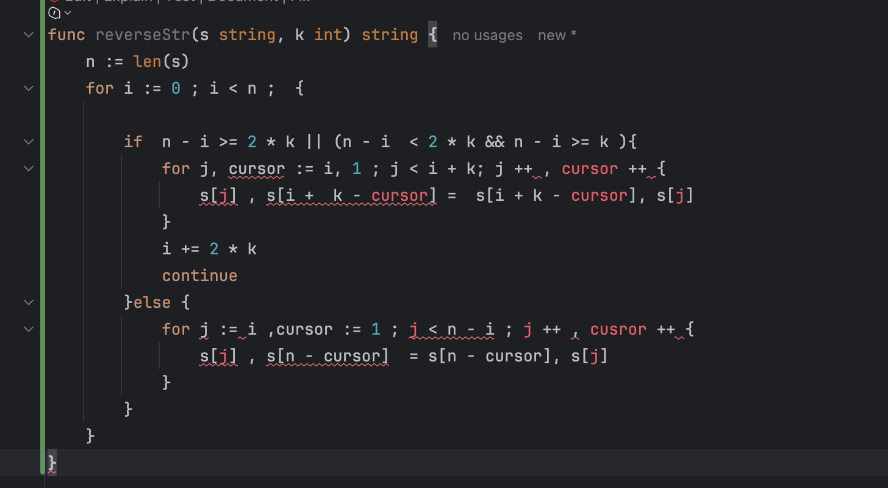
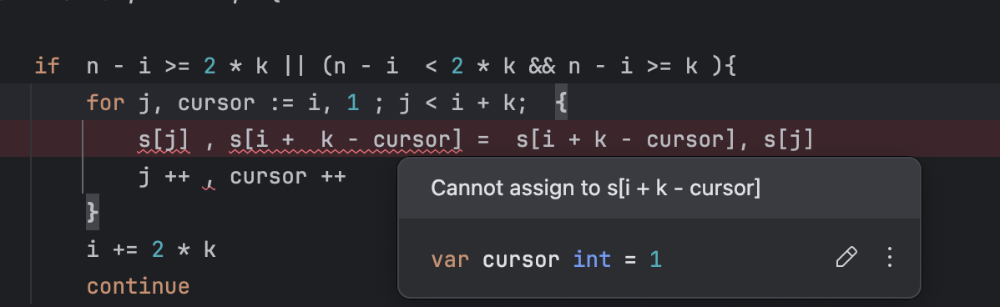

# 写在前面

做题的时候, 使用 For 写出了一个很诡异的代码




# 问题总结

## For 第一层声明

对于声明区间 只能选择声明一次 。

对于 

```go
for j := i ,cursor := 1 ; j < n - i ; j ++ , cusror ++ {
```

这种写法应该优化成

```go
for j, cursor := i, 1 ; j < i + k; j ++ , cursor ++ 
```

## For 第三层自增

对于这种写法， `Cursor`处会报错 是因为 Golang 中 ==没有逗号运算符==

如果想要处理的话 同样需要改成 j, cursor = j+1, cursor+1

```go
for j, cursor := i, 1 ; j < i + k; j ++ , cursor ++ 
```

## String 不可改

对于 String 类型，默认是只读的 并不可以更改， 要将字符串变成 `[]byte` 之后才可以进行读写操作

