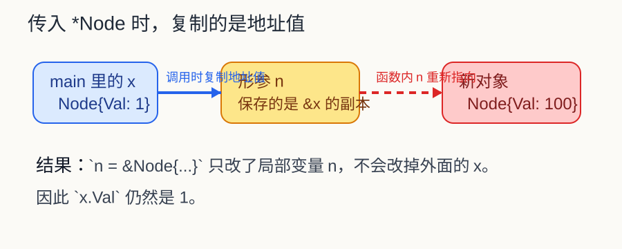
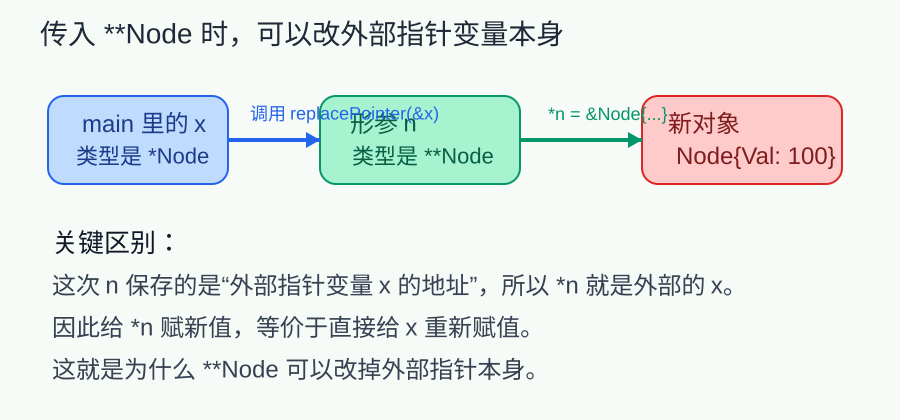

# 先说结论

很多人第一次看到下面这段 Go 代码，都会以为输出应该是 `100`：

```go
package main

import "fmt"

type Node struct {
	Val int
}

func changePointer(n *Node) {
	n = &Node{Val: 100}
}

func main() {
	x := Node{Val: 1}
	changePointer(&x)
	fmt.Println(x.Val) // 1
}
```

实际输出却是 `1`。

这不是 Go 的指针“失效”了，也不是编译器做了什么特殊优化。真正的原因只有一句话：

> Go 的函数参数永远是值传递，指针也只是“一个值”。

这里最容易产生认知误差的地方在于：

1. 我们确实传入了指针
2. 但传入的是“地址值的一份拷贝”
3. 你在函数里改的是这份拷贝，不是外面的变量本身

---

# 第一层理解：你改的是谁

先不要急着想“指针不是能改外部对象吗”，先把这行代码看清楚：

```go
func changePointer(n *Node) {
	n = &Node{Val: 100}
}
```

这里的 `n = ...` 改的不是 `*n`，而是 `n` 这个局部变量。

也就是说：

- `n.Val = 100` 是“顺着指针去改它指向的内容”
- `n = &Node{Val: 100}` 是“让局部指针变量重新指向别的对象”

这两个动作看起来都和指针有关，但影响范围完全不同。



上图里发生的事情可以概括成：

1. `main` 里有一个变量 `x`
2. `&x` 产生一个地址值
3. 调用 `changePointer(&x)` 时，Go 把这个地址值复制给形参 `n`
4. 函数内部把 `n` 指向了新对象
5. 外面的 `x` 从头到尾都没变

所以最终输出还是 `1`。

---

# 第二层理解：Go 里“传指针”不等于“引用传递”

很多人之所以会在这里绕住，是因为脑子里默认有这样一个联想：

> 传入指针 = 可以改外面的东西

这句话只说对了一半。

更准确地说应该是：

> 传入指针后，你可以通过这份指针副本，修改它当前指向的那块内存。

但是你不能仅靠修改这份“副本指针变量”，去修改外面的指针变量本身。

看两个对照例子就清楚了。

## 例子一：修改指针指向的内容

```go
package main

import "fmt"

type Node struct {
	Val int
}

func changeValue(n *Node) {
	n.Val = 100
}

func main() {
	x := Node{Val: 1}
	changeValue(&x)
	fmt.Println(x.Val) // 100
}
```

这里输出 `100`，因为：

- `n` 和 `&x` 虽然不是同一个变量
- 但它们一开始保存的是同一个地址
- `n.Val = 100` 改的是那块地址上的内容
- 所以外面的 `x` 会一起变化

## 例子二：修改局部指针变量自己的指向

```go
package main

import "fmt"

type Node struct {
	Val int
}

func changePointer(n *Node) {
	n = &Node{Val: 100}
}

func main() {
	x := Node{Val: 1}
	changePointer(&x)
	fmt.Println(x.Val) // 1
}
```

这里输出 `1`，因为 `n = ...` 只是把 `n` 这份地址副本改掉了，外面的 `x` 仍然是原来的对象。

---

# 第三层理解：如果真想改“外面的指针本身”，要传二级指针

如果你的目标不是“改对象内容”，而是“让外面的指针改为指向新对象”，那就不能只传 `*Node`，而要传 `**Node`。

```go
package main

import "fmt"

type Node struct {
	Val int
}

func replacePointer(n **Node) {
	*n = &Node{Val: 100}
}

func main() {
	x := &Node{Val: 1}
	replacePointer(&x)
	fmt.Println(x.Val) // 100
}
```

为什么这里就能改掉？

因为这次你拿到的不是“Node 的指针”，而是“外部指针变量 `x` 的地址”。

所以：

- `n` 指向的是外部变量 `x`
- `*n = ...` 等价于“给外部的 `x` 重新赋值”
- 这时外面的指针本身就真的被改掉了



这个例子也说明了一个很重要的区分：

- `n = ...` 改的是局部变量
- `*n = ...` 改的是外部变量

---

# 第四层理解：为什么你会觉得 C++ 里能改

这个误区很常见，因为 C++ 里确实有一种写法会让外部指针发生变化，但那通常不是“普通指针传参”，而是“指针的引用”。

先看 C++ 里和 Go 当前行为等价的写法：

```cpp
struct Node {
    int val;
};

void changePointer(Node* n) {
    n = new Node{100};
}
```

这段 C++ 和 Go 一样，外面也不会变。

因为本质上还是：

- 把一个地址值复制给形参 `n`
- 然后在函数内部修改 `n` 这份副本

真正能改外部指针的是这种写法：

```cpp
struct Node {
    int val;
};

void changePointer(Node*& n) {
    n = new Node{100};
}
```

这里的 `Node*&` 是“指针的引用”，它更接近 Go 里的 `**Node` 效果。

所以如果你记忆里“我在 C++ 这么写能改掉”，大概率你当时写的是：

- 引用 `T&`
- 或者指针引用 `T*&`
- 或者二级指针 `T**`

而不是单纯的“指针按值传递”。

---

# 一张表记住这件事

| 写法 | 改到的是什么 | 外部结果 |
| --- | --- | --- |
| `n.Val = 100` | 指针指向的内容 | 外部对象会变 |
| `*n = Node{Val: 100}` | 指针指向的整个对象 | 外部对象会变 |
| `n = &Node{Val: 100}` | 局部指针变量 `n` 自己 | 外部不会变 |
| `*pp = &Node{Val: 100}` | 外部指针变量本身 | 外部指针会变 |

如果只记一句话，可以记这个：

> Go 永远是值传递。传指针，只是把“地址值”复制了一份。

---

# 最容易写错的三组实验

下面这三组代码建议你自己跑一遍，认知会非常稳定。

## 实验一：修改字段

```go
package main

import "fmt"

type Node struct {
	Val int
}

func f(n *Node) {
	n.Val = 200
}

func main() {
	x := Node{Val: 1}
	f(&x)
	fmt.Println(x.Val) // 200
}
```

这里你改的是“地址里的内容”。

## 实验二：重新绑定局部指针

```go
package main

import "fmt"

type Node struct {
	Val int
}

func f(n *Node) {
	n = &Node{Val: 200}
}

func main() {
	x := Node{Val: 1}
	f(&x)
	fmt.Println(x.Val) // 1
}
```

这里你改的是局部变量 `n` 的指向。

## 实验三：传二级指针

```go
package main

import "fmt"

type Node struct {
	Val int
}

func f(n **Node) {
	*n = &Node{Val: 200}
}

func main() {
	x := &Node{Val: 1}
	f(&x)
	fmt.Println(x.Val) // 200
}
```

这里你拿到了外部指针变量的地址，因此能把外部指针重新绑定到新对象。

---

# 实战里怎么判断该用哪一种

如果你在业务代码里遇到类似场景，可以按目的来选：

## 只想改对象内容

用 `*T` 就够了。

```go
func fillUser(u *User) {
	u.Name = "Alice"
	u.Age = 18
}
```

这类写法最常见，也最符合直觉。

## 想在函数里“创建对象并回填出去”

可以考虑返回值，通常比 `**T` 更自然：

```go
func newNode() *Node {
	return &Node{Val: 100}
}
```

大多数情况下，Go 更鼓励这种写法，而不是到处传二级指针。

## 必须修改外部指针本身

这时再考虑 `**T`：

```go
func reset(n **Node) {
	*n = nil
}
```

但要注意，`**T` 会显著增加阅读成本，除非这个语义非常明确，否则优先考虑返回值。

---

# 最后，把认知纠正成一句完整的话

错误直觉通常是：

> 我传的是指针，所以函数里改了它，外面一定会变。

更准确的理解应该是：

> Go 中参数总是值传递。即使传入的是指针，也只是把地址值复制给形参。  
> 通过这个地址可以修改它指向的内容，但不能仅靠修改形参本身，去改变外部变量。

当你把“指针”和“引用传递”这两个概念拆开后，这类问题基本就不会再绕住了。

如果以后再遇到类似代码，先问自己两个问题：

1. 我现在改的是 `n`，还是 `*n`？
2. 我想改的是对象内容，还是外面的指针变量本身？

这两个问题一旦分清，答案通常就直接出来了。
