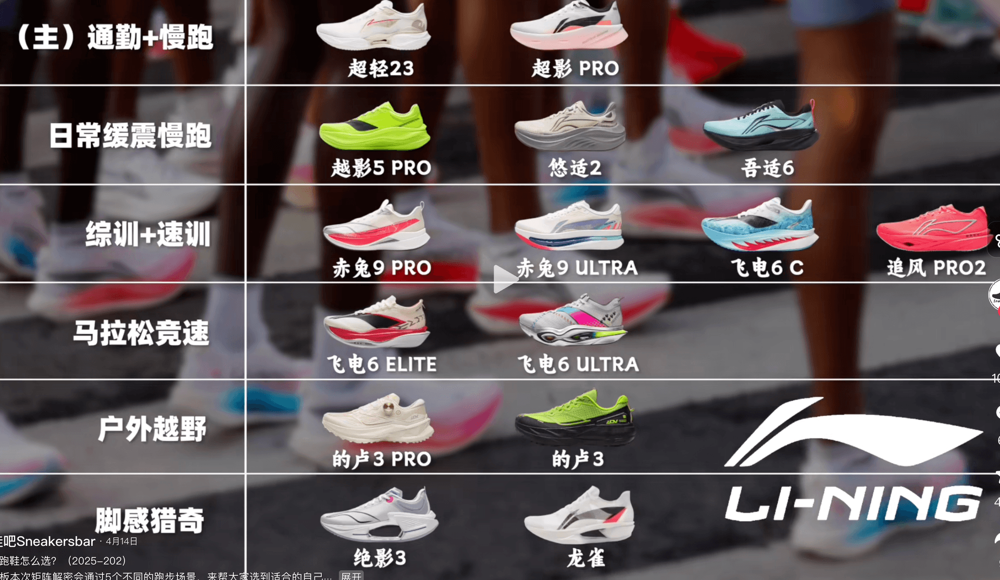
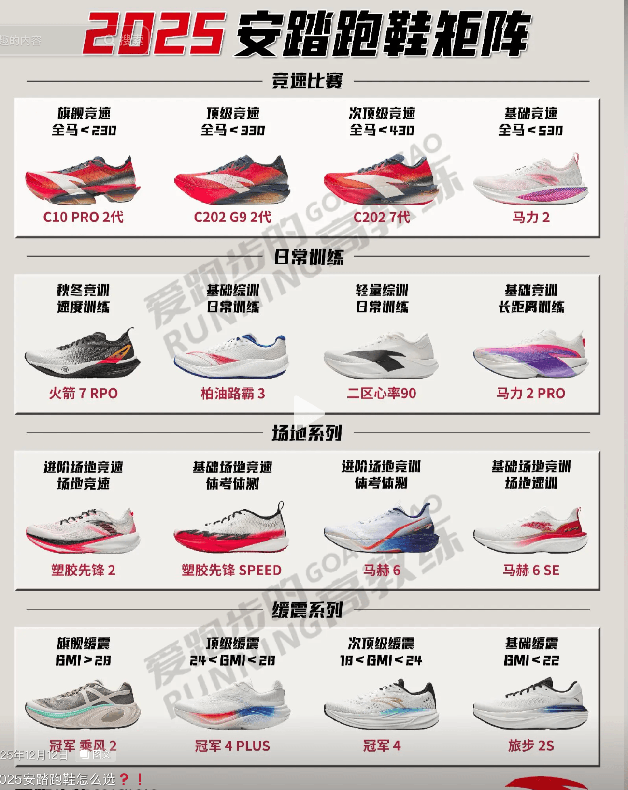
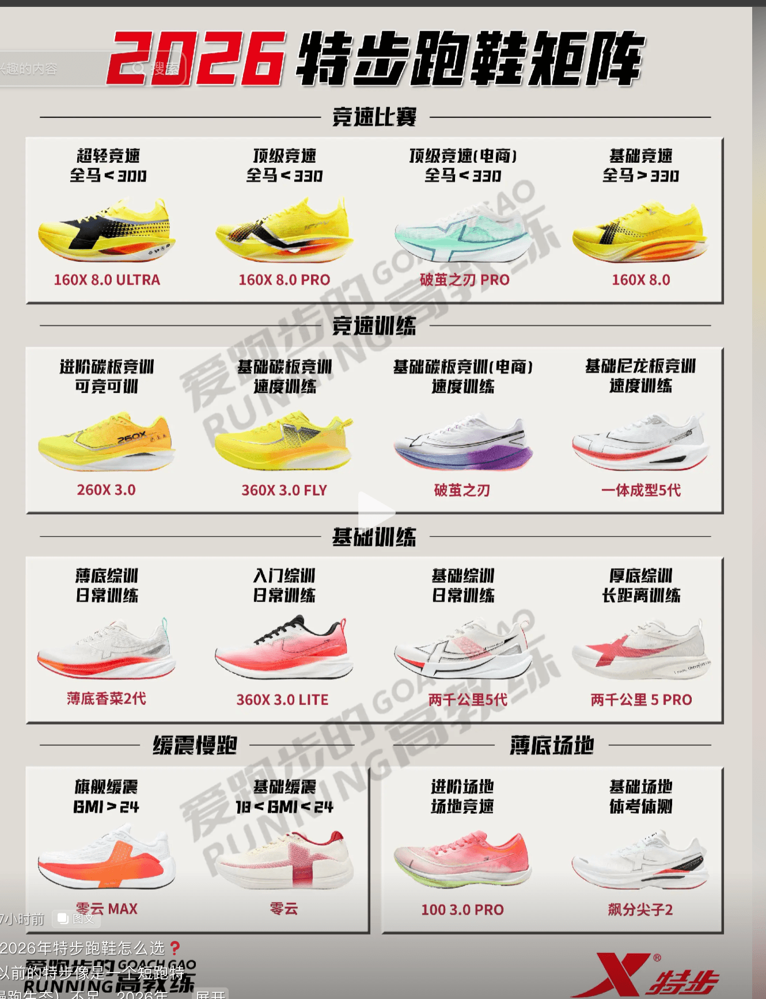
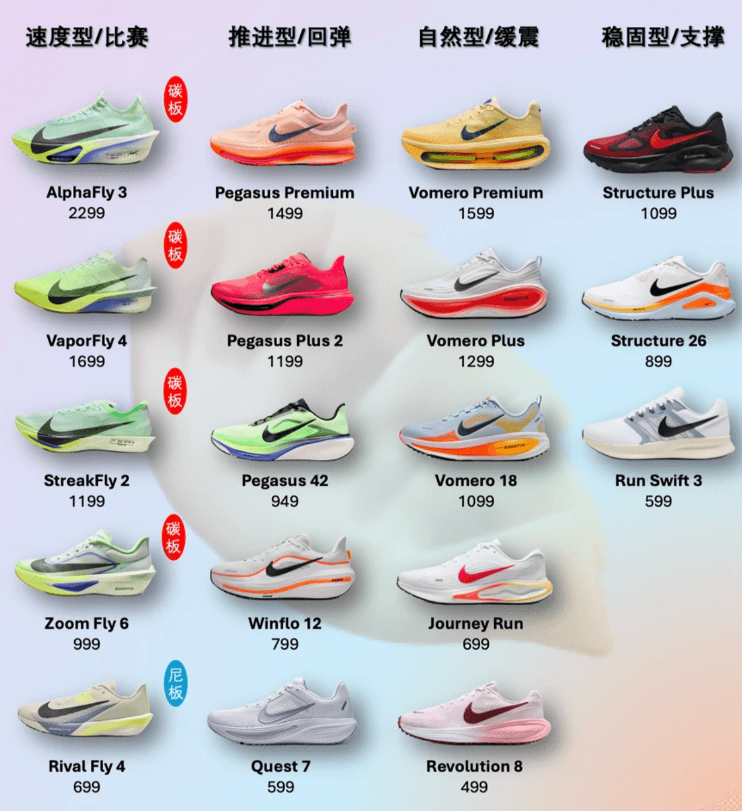
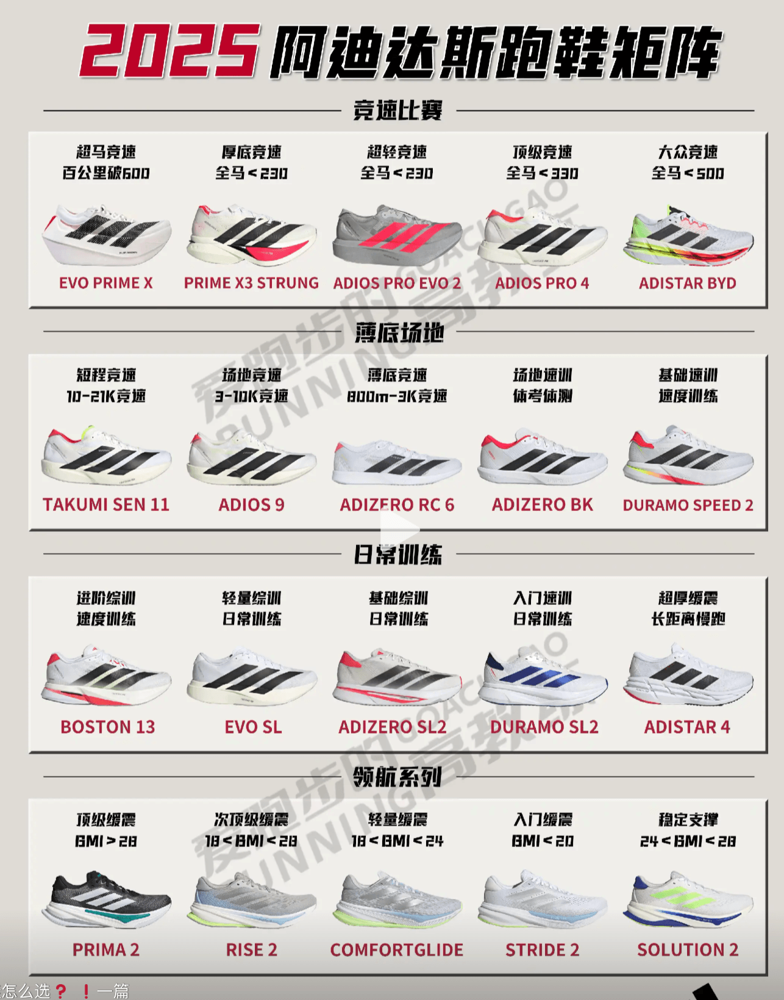

# 标准

1. 颜值: 较为简约 颜色不需要要鲜艳，外形好看 满足日常上班通勤
2. 底部: 不需要较为大的缓震的底，因为在公园路不太好跑，容易崴脚
3. 价格: 500左右

# 李宁

李宁看下来只有 赤兔9 PRO 合适，毕竟初中的时候 穿过 赤兔1 感觉挺不错的

不过还没有试过脚感 

{.small}

# 安踏

看着 C202 和 二区心率 90都挺不错

{.small}

# 特步

看着 160x 8.0 和 两千公里 5 PRO 都挺好的6

160x8.0 800+了 ，感觉可以看看 3.0 5.0pro

{.small}

# Nike

迈柔 18 ， 大概 500左右

{.small}

# Adidas 

波士顿13 和 EVO SL

{.small}

# Prompts

我现在的跑鞋是 Nike 迈柔Plus，我身高 165， 体重140 ，前脚掌着地

最近跑步场地变为公园跑，公园有一些高低不平的地，对于 Nike 迈柔Plus 这种顶缓 会导致我可能崴脚，感觉很考验我的脚踝力量

所以我想要更换一个跑鞋，有以下几个选择，满分100分，请你给他们打分，并且按照优先级输出

1. 李宁 -  赤兔9 PRO
2. 安踏 C202 7代
3. 二区心率 90
4. 特步 160x 8.0pro 
5. 特步 两千公里5 Pro
6. 特步 160x 3.0 5.0pro这种系列
7. Nike 迈柔18 非plus
8. Adidas 波士顿13 
9. Adidas EVO SL

## Deepseek

| 优先级 | 跑鞋型号 | 评分 | 核心评价 |
|:---:|:---|:---:|:---|
| **1** | **特步 两千公里5 Pro** | **92** | 宽楦+抗扭片提供极致稳定，公园路面最佳选择 |
| **2** | **李宁 赤兔9 PRO** | **88** | 翼状TPU支撑+加宽中底，稳定与灵活兼备 |
| **3** | **Nike 迈柔18 非Plus** | **85** | 双层密度中底，比Plus版更稳定，路面适应好 |
| **4** | **Adidas 波士顿13** | **80** | 后跟支撑扎实，前掌灵活，但对足弓支撑偏弱 |
| **5** | **特步 160x 5.0pro** | **72** | 碳板竞速鞋中稳定性较强，但对脚踝力量要求高 |
| **6** | **安踏 C202 7代** | **68** | 碳板推进感强，但稳定性一般，长距离支撑不足 |
| **7** | **特步 160x 8.0pro** | **55** | 稳定性偏弱，低速慢跑脚感生硬，不适合公园路面 |
| **8** | **Adidas EVO SL** | **50** | 侧向稳定性差，不适合不平整路面 |
| **9** | **二区心率 90** | **42** | 中底软、足弓支撑弱，脚踝力量差者需谨慎 |

## ChatGpt

| 排名   | 跑鞋                        |    综合分 | **你的场景适配** | 核心评价                 |
| ---- | ------------------------- | -----: | ---------: | -------------------- |
| 🥇 1 | **李宁 赤兔9 PRO**            | **92** |      ⭐⭐⭐⭐⭐ | **最符合你的需求**          |
| 🥈 2 | **特步 两千公里5 PRO**          | **90** |      ⭐⭐⭐⭐⭐ | 稳定、耐久，但脚感偏韧          |
| 🥉 3 | **安踏 C202 7代**            | **87** |      ⭐⭐⭐⭐½ | 稳定和前掌跑法比较合适          |
| 4    | **Adidas Boston 13**      | **85** |       ⭐⭐⭐⭐ | 稳，但更偏训练/提速           |
| 5    | **特步 160X 5.0 PRO**       | **82** |       ⭐⭐⭐½ | 前掌跑友好，但不一定适合你当前需求    |
| 6    | **特步 160X 8.0 PRO**       | **80** |       ⭐⭐⭐½ | 性能很强，但明显不是你的最优解      |
| 7    | **Nike 迈柔18 非Plus**       | **77** |        ⭐⭐⭐ | 比 Plus 更适合，但解决不了根本问题 |
| 8    | **特步 160X 3.0 / 3.0 PRO** | **74** |        ⭐⭐⭐ | 偏性能，不建议为了“稳”去买       |
| 9    | **Adidas EVO SL**         | **70** |        ⭐⭐½ | **你的这个场景我反而不推荐**     |

## gork

| 优先级 | 鞋款 | 满分 | 重量 (g) | 缓震 | 稳定性 | 回弹 | 滚动/推进 | 透气/耐磨 | 舒适度 | 性价比 | 推荐理由 |
|--------|------|------|----------|------|--------|------|----------|----------|--------|--------|----------|
| 1 | Adidas Adizero EVO SL | 98 | 209-213 | 39mm | 高 | 高 | 动态推力 | 良好 | 顶级 | 高 | 超轻高缓震，前掌着地吸收冲击强，防扭脚最优，无板动态设计完美匹配重体重+公园路 |
| 2 | 李宁 赤兔9 PRO | 97 | 190-200 | 高 | 高 | 高 | 前掌推进 | 极强 | 高 | 高 | 双密度轻弹+展翼支撑，轻量+稳，透气好，280km不衰，匹配你前掌+扭脚需求 |
| 3 | 安踏 C202 7代 | 96 | 212.9 | 85/双层氮 | 高 | 高 | 全域XL碳板 | 良好 | 高 | 高 | 碳板+氮中底，推进+稳，双重缓冲，性价比高，适合半马/长跑公园路 |
| 4 | 特步 160x 8.0pro | 95 | 轻量 | 高 | 高 | 高 | 黄金碳板 | 良好 | 高 | 极高 | 碳板推进+软弹，轻量+稳，公园路吸收冲击强，性价比无敌 |
| 5 | 特步 两千公里5 Pro | 94 | 轻量 | 高超临界 | 高 | 高 | 无板软弹 | 优秀 | 高 | 高 | 耐磨5000km+宽楦支撑，软弹吸收冲击，无板不易扭脚，堆量神器 |
| 6 | 特步 160x 3.0 / 5.0pro | 93 | 轻量 | 高 | 高 | 高 | 异构碳板 | 良好 | 高 | 高 | 上一代碳板旗舰，轻量+推进+稳，性价比高，耐磨略逊8.0pro |
| 7 | Nike 迈柔18 非plus | 92 | ~250 | 36/46mm | 中 | 高 | 厚底 | 良好 | 顶级 | 高 | 超软弹舒适，但顶级缓震易过软，稳定性不如碳板，公园路扭脚风险中 |
| 8 | 安踏 二区心率 90 | 90 | 183-188 | 氮90+软弹 | 中 | 高 | 无板 | 良好 | 高 | 极高 | 软弹吸收冲击好，但无板易扭脚，适合纯有氧不推荐公园路 |
| 9 | Adidas 波士顿13 | 89 | 252 | 6.3 | 7.6 | 7.6 | 好 | 良好 | 高 | 高 | 中性轻量，缓震+滚动好，但碳板弱，公园路稳定性一般 |

## Summary

根据下面提供的3个表格，其中 DeepSeek 权重 3，ChatGpt 权重2.5，Gork权重 1 来进行整合数据

权重越高越优先 

下面按“**权重越高越优先**”整合：
- **综合优先级分 =（DeepSeek优先级×3 + ChatGPT排名×2.5 + Gork优先级×1）÷ 参与来源权重和**，分数越低越优先。
- 缺失来源不参与该鞋款计算；Gork 的“特步 160x 3.0 / 5.0pro”为合并项，我同时映射到 5.0pro 与 3.0/3.0 PRO。
- 同分时，参考“加权评分”更高者优先。加权评分因各表评分尺度不同，仅作参考。

## 整合后综合排名

| 综合排名 | 鞋款 | DeepSeek 权重3 优先级/评分 | ChatGPT 权重2.5 排名/综合分 | Gork 权重1 优先级/满分 | 加权名次分↓ | 加权评分↑ | 综合结论 |
|---:|---|---:|---:|---:|---:|---:|---|
| **1** | **李宁 赤兔9 PRO** | 2 / 88 | 1 / 92 | 2 / 97 | **1.62** | **90.92** | 三源均在前二，稳定与灵活兼备，综合最优先 |
| **2** | **特步 两千公里5 Pro** | 1 / 92 | 2 / 90 | 5 / 94 | **2.00** | **91.54** | DeepSeek第1、ChatGPT第2，宽楦+抗扭，堆量稳定首选 |
| **3** | **安踏 C202 7代** | 6 / 68 | 3 / 87 | 3 / 96 | **4.38** | 79.62 | ChatGPT/Gork均第3，碳板推进强；DeepSeek认为稳定性一般 |
| **4** | **Adidas 波士顿13** | 4 / 80 | 4 / 85 | 9 / 89 | **4.77** | 83.31 | 后跟支撑扎实，前掌灵活，但足弓支撑偏弱 |
| **5** | **Nike 迈柔18 非Plus** | 3 / 85 | 7 / 77 | 7 / 92 | **5.15** | **83.00** | 比Plus版更稳，但整体不是最优解 |
| **6** | **特步 160x 5.0pro** | 5 / 72 | 5 / 82 | 6 / 93* | **5.15** | 79.08 | 碳板竞速中稳定性较强，但对脚踝力量要求高 |
| **7** | **特步 160x 8.0pro** | 7 / 55 | 6 / 80 | 4 / 95 | **6.15** | 70.77 | Gork评价高，但DeepSeek认为稳定偏弱、低速慢跑生硬 |
| **8** | **Adidas EVO SL** | 8 / 50 | 9 / 70 | 1 / 98 | **7.31** | 65.08 | Gork排第1，但DeepSeek/ChatGPT权重更高且排名低，综合不推荐 |
| **9** | **特步 160X 3.0 / 3.0 PRO** | 未提及 | 8 / 74 | 6 / 93* | **7.43** | 79.43 | 偏性能，不建议为了“稳”去买 |
| **10** | **安踏 二区心率 90** | 9 / 42 | 未提及 | 8 / 90 | **8.75** | 54.00 | 中底软、足弓支撑弱，脚踝力量差者谨慎 |

