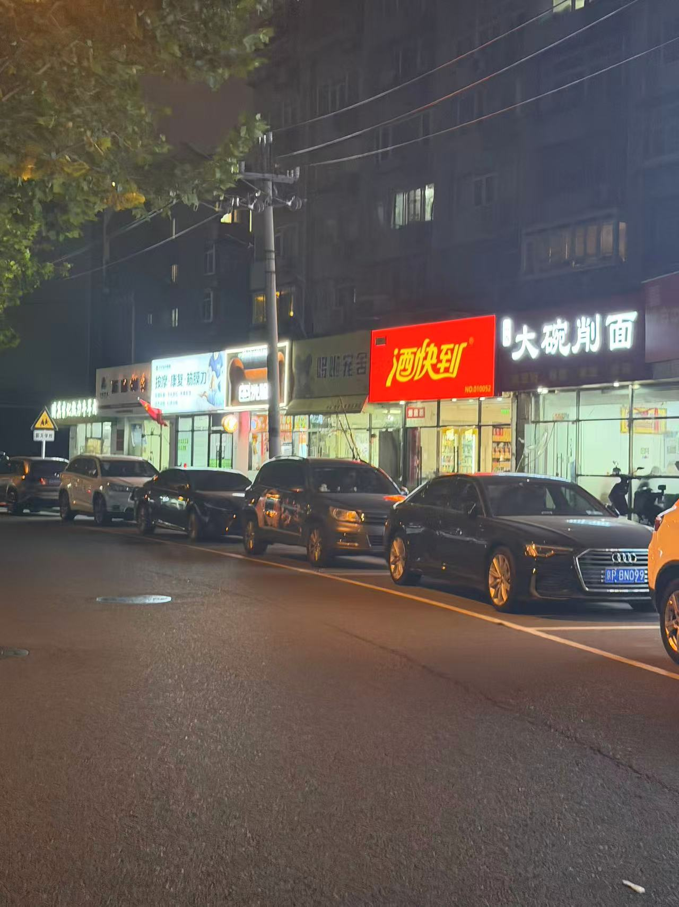

# 写在开头

我 7月17 号被裁员 ，我的策略是

- 先看一下 邓明的Golang初级开发课程
    - 登陆注册、Feed流、文章模块、支付模块、微服务拆分模块
- 然后补了一下一个 单Agent 的 AI 项目
  处理了这两个内容花了我一个月时间，然后我开始投递和准备八股文 。

然后开始投递大概半个月还是1个月时间，或者说面试了2周，9月17号左右到达北京

我只有Golang这个语言栈，导致我能投递的岗位很少，**感觉全中国只有 300家**。

我投了符合工作经验的 **180 家** ，最后约面的 **只有 14 家**

最终我只拿到了 2 家 或者说 只拿到了一家

一家北京的字节外包，我不确定这个是什么形式的外包。 北京阅安，今年4月份成立的公司。 涨薪40%

一家深圳的Ai公司，但是这家公司比较小。我完成了 CTO面之后，hr面给我鸽了，说是没有HC了. 有些生气，但是也无可奈何 。

```txt
xxx，是这样的，坦诚跟你交流， 内部有一个人，总体磨合下来，欠缺了一点。
我收到你短信的时候，我去跟技术口沟通了。
上级还在犹豫，技术口是希望能再给他机会，看看有没有改进的空间。
但是也担心会耽误你，你看这样行不行，您这边也可以再留意一下其他机会。
我们内部也再看下是否要果决一些。
```

# 来北京之前

来北京之前呢, 我和我谈了好久的女朋友发生了关系, 她今年还在准备考研时间并不是很多。 我跟她线下见面了好几次

最终发生了关系, 我和她尝试了好多第一次我没尝试过的东西 

1. 一起去饭店吃饭
2. 一起在河边散步
3. 一起坐摩天轮
4. 一起吃烧烤
5. 一起亲嘴
6. 一起舌吻
7. 一起住酒店
8. 第一次去KTV
9. 一次喝奶茶
10. 一起吃肉蟹煲
11. 第一次去线下的Switch游玩店
12. 一起骑车
13. 一起拥抱
14. 一起睡觉
....

说实话我单身了 20多年了，第一次和女孩子做这些内容，我们双方都很喜欢对方，她很信任我，我也很喜欢她

我认为我的后半生都给她了，至少目前是这样的。

虽然不知道是不是上天凑巧，让我在被裁员的时候 她主动加我的联系方式，还是什么 。虽然凑巧 但是也不凑巧

因为她在考研所以我不能打扰她，而且我被裁员了我还要准备我的工作面试 。所以呢 我一个人来到了北京


# 来到北京

我一个人来到了北京，住在北京海淀区。这里是北京的三环，但是给我的感觉很差，我在北京待了3天，待一天骂一天

首先

1. 地铁。 北京的地铁很多，但是地铁修的并不好，地铁站比较小而且很多
2. 高铁。 北京的高铁站和其他高铁站差不多，而且人很多，我周四下的高铁 人都爆满
3. 住房。 3000块钱只能租到一个合租的地方，如果想要整租需要4000，5000 。我之前在长沙都只要1500啊
4. 吃的。 3环这边全是小区楼没有大的商场，全都是小店铺 也没有地摊，吃的东西都是甜食，人均20+，30+
5. 环境。 健身房死贵，附近没有可以跑步的地方，这里除了胡同就只有胡同。

总之我对北京彻底失望了，我破防了，但是我房租已经交了，其实我来北京那一天我就想过 要不要直接回老家继续面试了，但是没有人理我，我的女朋友没理我，我的群友没理我，我的姐姐没理我。所以我就这么租了

而且北京这里都是押一付3，我怎么都要工作了


