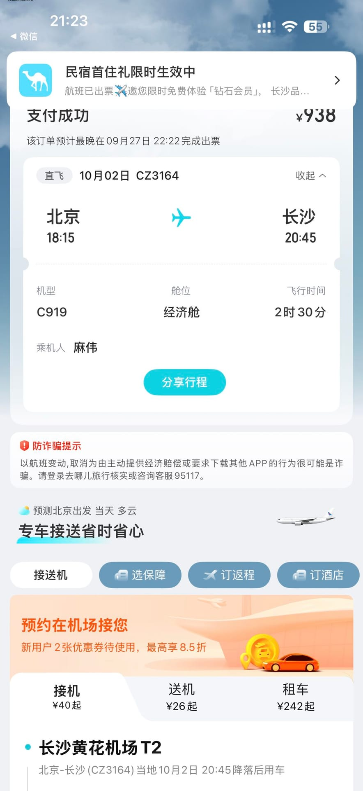
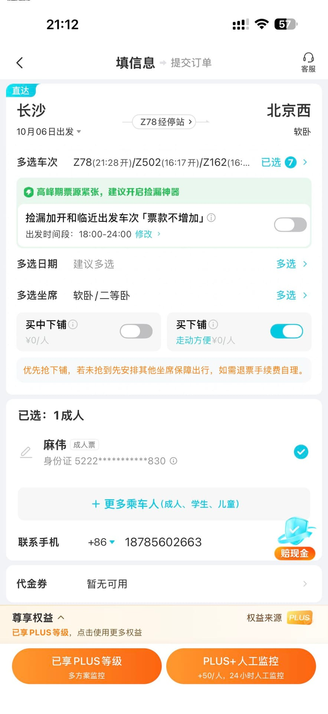

# 日程规划

10-2日 : 出发, 预计晚上 20.45 到

10-3日 : 完整的一天

10-4日 : 完整的一天

10-5日 : 完整的一天

10-6日 : 准备返程 ==抢票中== 

{.inline} {.inline} {.inline}

# 一些日期的规划

## 10-3日

去步步高吃个饭, 然后去几多全买点零食 用于在酒店摆烂

1. 买点蛋糕
2. 麻辣
3. 锅巴
4. 干果什么的

## 10-4 | 10-5 日

暂时没有想法,  可以考虑在酒店学习 然后晚上跑步 

10-5日晚上 预计去河边散散步

## 10-6 日

准备返程

去满意饭店或者是哪个饭店再吃一顿 然后走人

## 想做的事

1. 去一次 KTV . 这次就是真唱歌了
2. 做爱 

   i. 持久性 和 勃起兴药物尝试

   ii. 更多动作的尝试

1. 河边散步（晚上）
2. 吃一顿好吃的 (煲)

3. 一起去拔罐