# 22:27 的感想

今天发生了很多事，唯独没有学习，明明什么都没有改变，但是我感觉到了我的存在

# 早上

早上起来其实还是很焦虑的, 因为上班的这三天确实没学到什么东西，或者说没感觉学会什么东西

但是我其实有一个 **疑问**

==我其实渴望的是有人带我, Leader 或者是其他同事，但是其实有一个问题就是，我的前Leader来公司的时候，他又是谁带的呢==

Leader 的上级只有产品经理和CTO，那么他也没人带，他只能自己读代码，自己看文档，自己体验系统 。

我上家公司有几个特点

1. 代码比较统一 前端后端代码在一起，容易从接口找到对应的实现
2. 系统比较统一 系统就只有 stage preprod prod 线上 等环境，而且功能比较通俗易懂
3. 文档很少，或者说几乎没有

我当前这家公司有几个特点

1. 仅仅只有后端代码，前端代码不知道在哪个项目 我也找不到 只能找到后端接口
2. 系统换进很多，什么 BOE 、stable、新加坡，plus 啥的好像有8个环境，每个环节都需要单独申请，也没有对应的URL访问
3. 文档很多，多到杂乱无章

所以我Leader是怎么学习的，他也没人带啊，为什么我不能学习，为什么我学不会呢，我感觉我应该也要学会 ？

所以早上其实压力很大，本来计划学习3天的，但是早上起来的时候拉肚子了，我感觉是吃鸭腿饭拉的肚子

昨天没设置闹钟，今天不是 8:30 起来的，而是 9:00 肚子闹醒的，特别拉肚子

拉肚子之后，然后回床上躺着，躺着很舒服，躺到了 10:30左右吧，然后开始点早饭

今天不知道是压力大还是不开心，早上点了两份饭 

1. 一份是过桥米线
2. 一份是小笼包10个+混沌

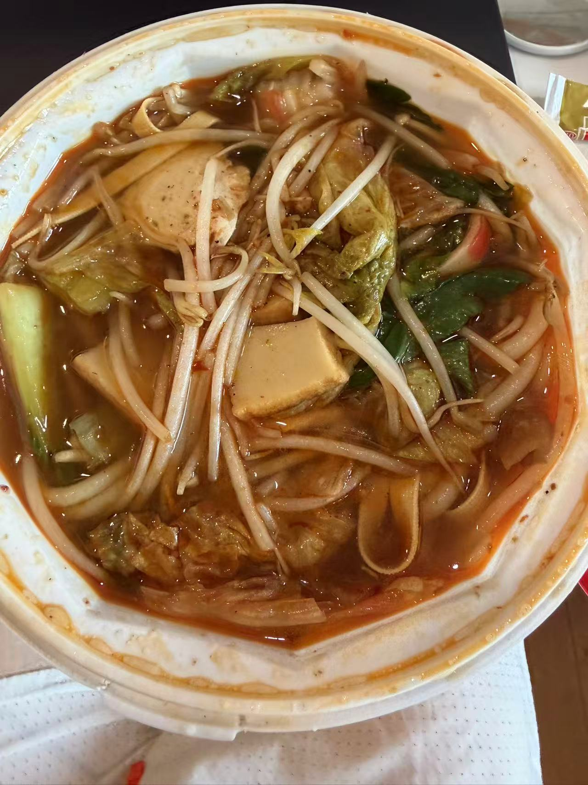{.inline} 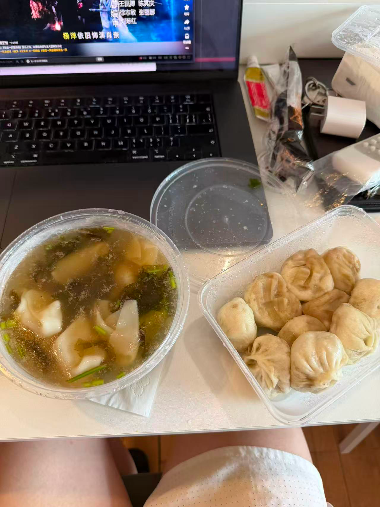{.inline}

吃完过桥米线就吐了，因为保持体重，不得不说，我喜欢这种吃了就吐的感觉

然后吃小笼包+混沌。北京这里的小笼包谈不上难吃，但是也没有好吃到哪里去，不过我喜欢面泡汤的感觉 非常好吃

吃完之后，然后就躺床上 和 女朋友聊天了

哦 然后途中又起来吃了两个鸭腿，然后又吐掉了 期间还吃了一个玉米

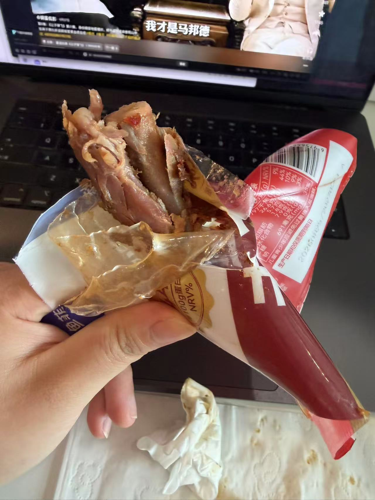{.inline} 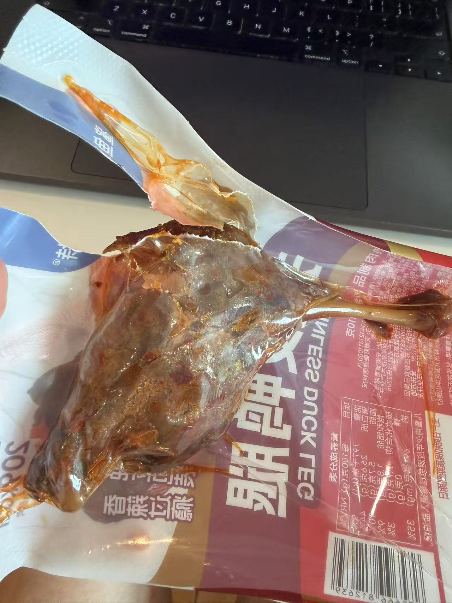{.inline}

聊天，睡觉，刷抖音

我 12:00 左右定了一个计划，就是清理一下我抖音的点赞 大概4000多个视频

我之前都有一个习惯就是 定期清理点赞的内容 要么取消点赞 要么移步到收藏。但是最近找工作太忙，加上其他事情

导致我的喜欢暴涨了，我约定是看到 13:00 。结果看到 12:30 其实就没看进去了

因为我发现 我确实 这几个视频都是我喜欢看的，但是他又没有那么值得进收藏，所以就没什么兴趣继续看了

# 下午

13:00 睡觉，本来想要睡个 20分钟的，但是眼睛一闭 各种想法从脑海里面冒出来

例如 “某个学弟或者是朋友 保研啊 找到好工作什么的”“北京为什么这么烂”“我的下一份工作怎么办”“我跟我女朋友的未来怎么办”

然后没睡着，大概继续刷抖音到了14:00左右 洗了个头

然后打算出门，我前几天买的单肩包很好背，我本来只是打算出门买个瑞幸喝的，因为我女朋友今天生理期 在中午喝了奶茶 所以我想着我也喝点

洗了个头，然后穿个衣服背个包出去了

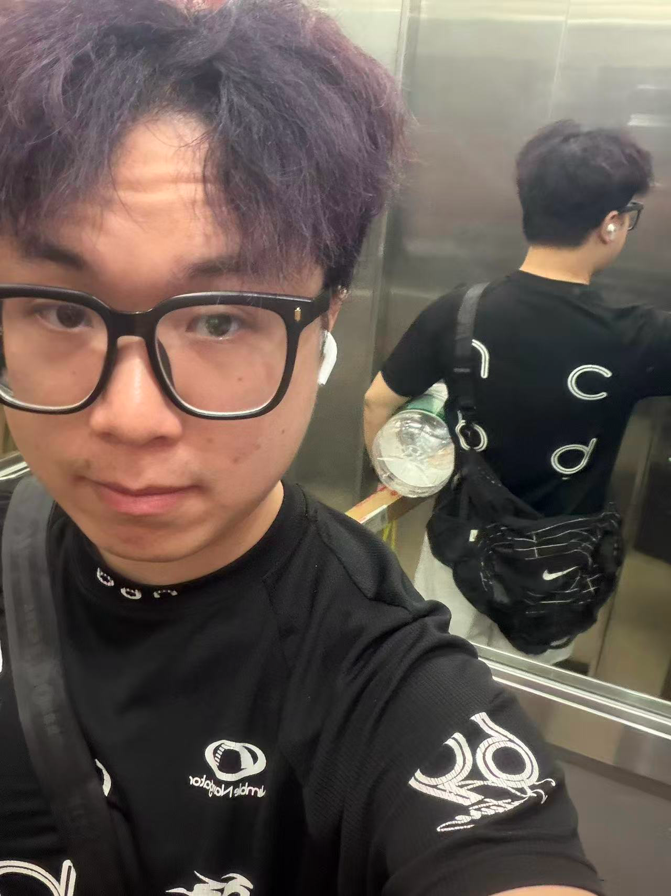{.inline} 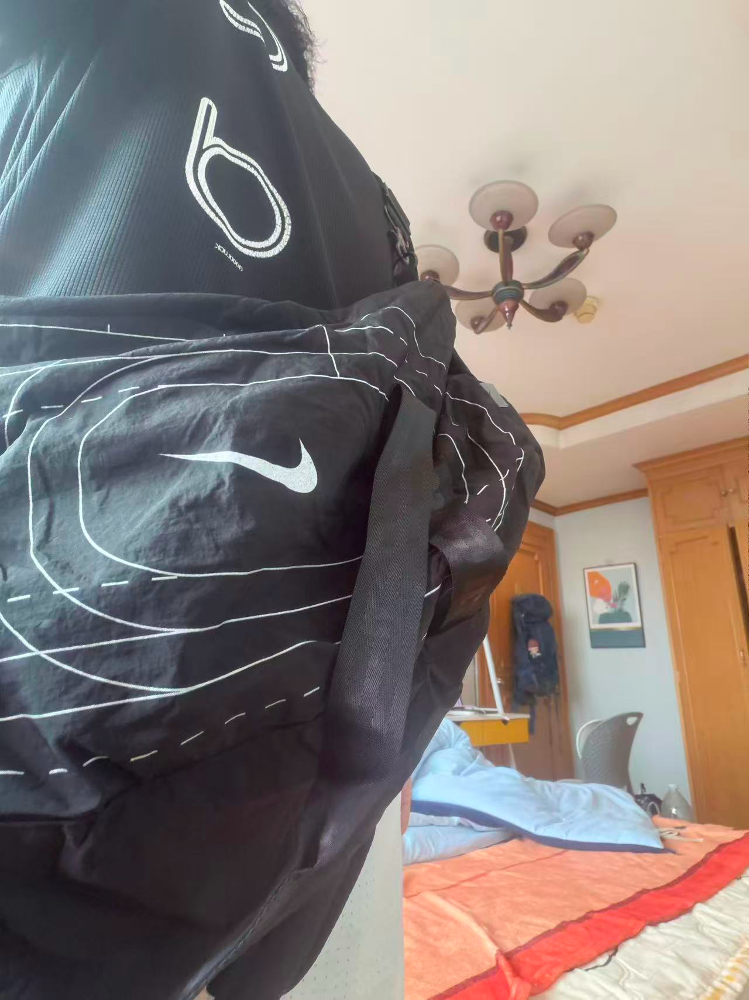{.inline} 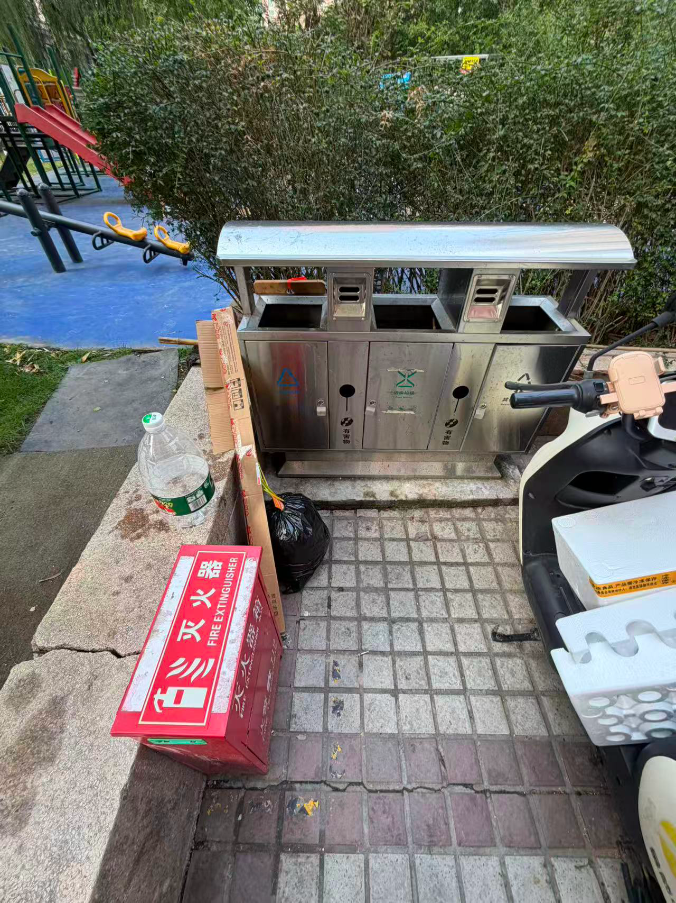{.inline}

一走出门 突然就想吃个雪糕，因为之前来北京的时候 看到过好几个没见过的雪糕，正好今天节日 正好去买

买了一个 巧克力的雪糕 5 块钱，还买了一包呀土豆，和香肠 打算去旁边的公园 坐着 。然后去拿我的瑞幸

在公园坐着 1个小时，很爽，一天最爽的时候了 

下午有太阳，公园，吃零食，和女朋友聊天，没有蚊子也不算很热

本来想再坐会的，但是16:30左右没太阳了 太冷了，而且蚊子也出来了

然后我就回去了

## 晚上

回去的时候 点了一份鸡公煲， 和女朋友聊天的时候 不小心水洒到笔记本上了 不过还好我是 MAC 笔记本放水

鸡公煲不算特别好吃，但是也要20+，北京的外卖就是这么贵

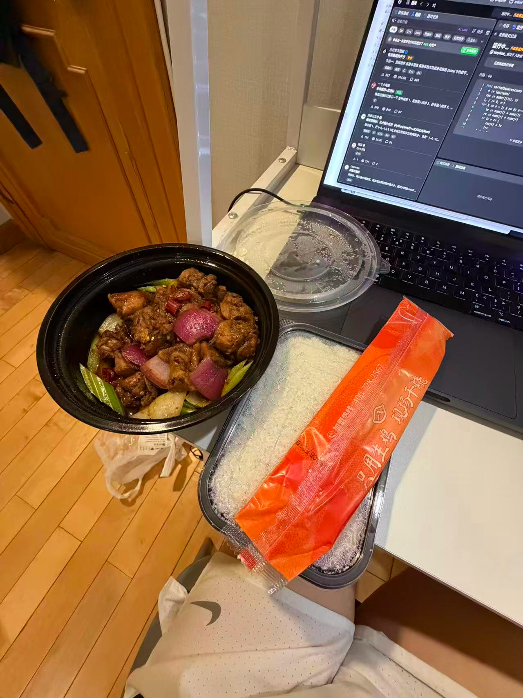{.inline} 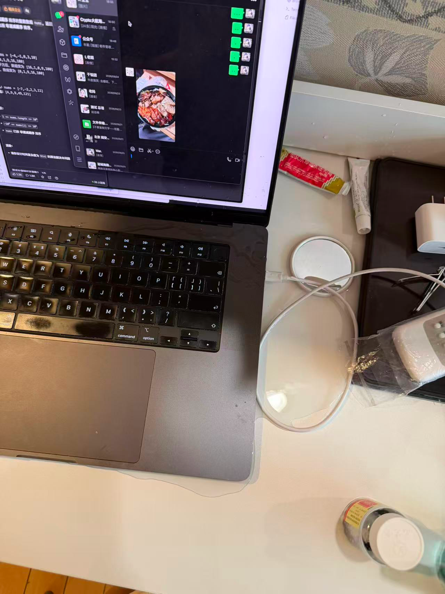{.inline}

下午的时候 我记得我坐了40个哑铃弯举

吃完饭 刷了会抖音，期间刷了5个算法题，都是比较简单的 [算法题单](https://my.feishu.cn/wiki/Ems8wKdzMiF7vfkyIFxcfLihnth)

题目来源于 我购买的一个后端训练营的 算法打卡内容，不是按类别进行分类的，而是按照周和天出的题

断断续续大概刷了1个小时 涉及 暴力模拟、快慢指针、滑动窗口、二分什么的，都是为了处理面试的

然后晚上休息了一个小时 出去跑步了，今天就是想跑所以去跑了，因为今天除了去公园走走还没什么运动

而且我想看看那个公园晚上能不能跑步，毕竟我想知道我下班后还能不能运动，如果不行的话 可能需要找另外一个路线了

没想到竟然可以跑步，而且配速还能接受，我感觉我配速可能慢到 8分配了，因为担心崴脚，，可是实际还是在 6分配的范围

跑完步，我母亲突然找我，问我一些家常，然后我和女朋友吐槽了5分钟

说什么我母亲自私，没有在我需要她的时候 给予关怀，我现在不需要了又来嘘寒问暖。 而且给一些傻逼都知道的话 例如 不要去跑太黑的地方，吃饭没有，放假几天什么的

我反正对我父母没什么好感，我无非是他们生出来养儿防老的工具，可是说实话 为什么是我，为什么是我来吃这个苦，如果我家有钱，我可以养儿防老，但是为什么没钱还要帮你们养老

跑完步之后回去洗澡，洗衣服

和女朋友打视频，打完之后又和我母亲打视频

因为她说她明天有空给我打，我并不想明天空出某一些时间跟她扯什么话，所以我洗完澡就给她打了，这次没说什么 

就说 “一个人在北京有没有钱”“累不累”什么的，至于那些家常 和 什么时候结婚，多存钱什么的话 倒是没说 。而且说了一些欣慰的话 例如 ==“我也没什么好说的，那些常说的话 你也听烦了我就不说了”== 

挺好的，然后我就挂了电话 。 继续和女朋友打视频

后面又做了一组无氧，然后上了个厕所，写了一下题解，随便看了一下抖音什么的 ，23:00之后开始写我这篇日记，同时优化一下我的这个项目的内容

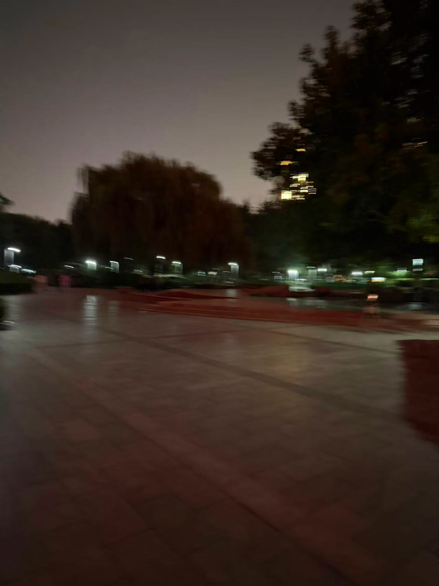{.inline} 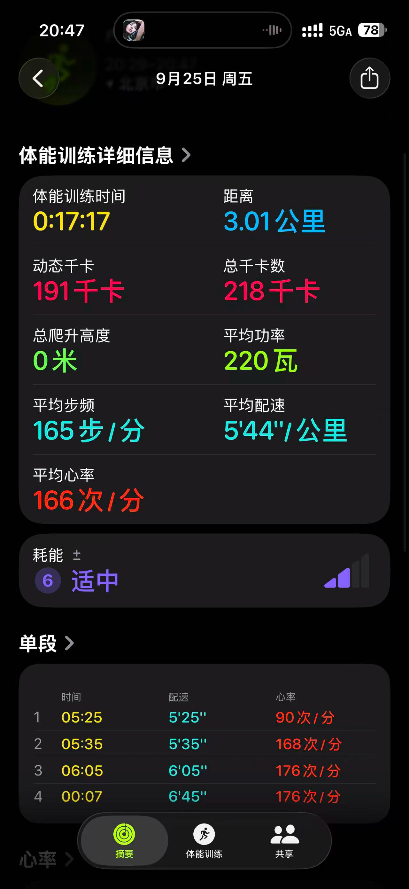{.inline}

# 总结

从课题分离的角度看 我今天既没有在股市赚钱 也没有在 学习方面努力 理论上来说 我是悲观的一天

但是 我下午在公园吃零食，晚上跑步 然后和 父母沟通 同时今天还和女朋友打视频打了很久 说了很多，而且今天还不用上班 

我感觉 我至少存在了某一段时间，这就是我，我感觉很爽，或许这就是生活的意义
