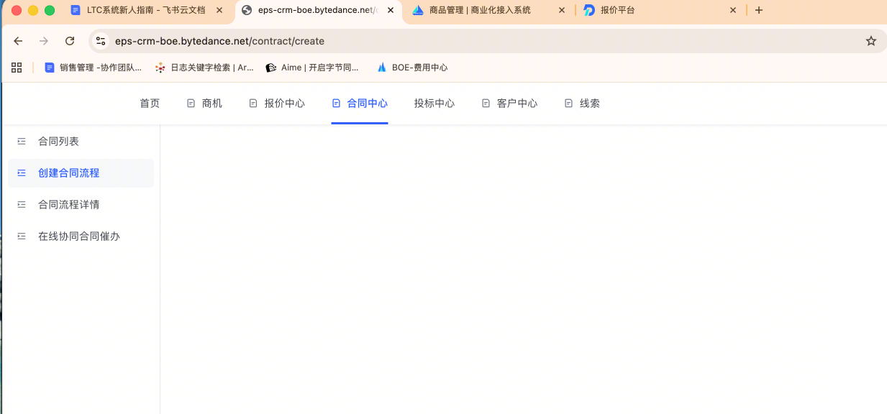
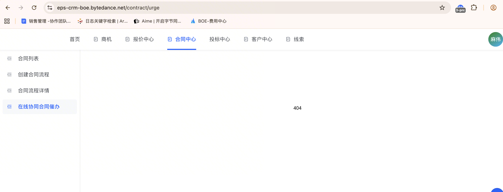
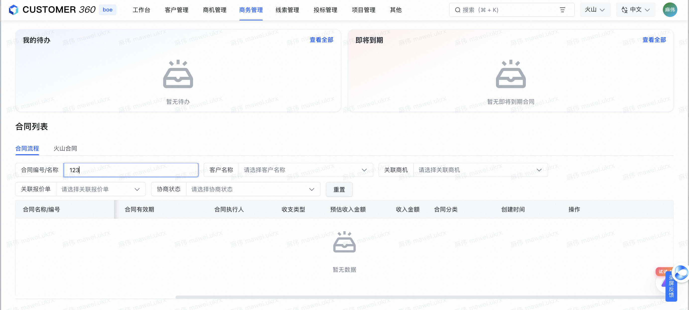

# 现有的问题

1. Leader 属于放养的状态 
2. 项目主流程走不通
3. 甚至找不到业务前端界面，不能从业务出发 然后找到对应的 Rest 页面从而找到对应的代码
4. 整个业务内容太大了

# 解决 (分而治之)

先根据 [LTC(系统新人文档)](https://bytedance.larkoffice.com/wiki/SY5ewnA1GiV43XkK225cJTQsnfe) 看了一下我们系统的相关模块

根据文档中的 系统地址，尝试进行一些 业务操作的熟悉


```
系统地址
- 商品：https://noah-b.bytedance.net/comm/commodity/product
- 报价：https://quote.sre-boe.bytedance.net/quote-list
- CRM：https://eps-crm-boe.bytedance.net/quote/list
```


## 一些问题

对于 **报价** 系统，访问的时候表示没有权限，昨天询问 Leader 的时候，说我不负责这个模块，我先 SKIP 了

然后我尝试去访问 CRM 页面，因为商品页面也不是我负责的 

### CRM 问题

1. 访问 CRM 创建合同流程的时候 页面空白 也没有权限报错
2. 访问在线协同合同的时候 页面 404  

没有什么比较好的 IDEA 直接去问了 ，第一天入职的时候 Leader @带我的负责人 

负责人叫我询问 CRM 相关的开发同学，询问后暂时无果

  

后续 :

给我提供了一个 New 360 版本的平台，但是给我开通的权限是 直销 权限

没有看到创建合同 和 合同流程 的操作。  

没什么想法 感觉更复杂了

[CRM_360](https://c360-boe.bytedance.net/opportunity/list?relationType=true)



#### 名词解释

CRM (Creator Recommendation Matchmaking) 达人定向货盘推荐系统，仅 TikTok 内部使用

实际体验下来感觉是一个多纬的后台管理系统

包括管理 (商机、管理报价、管理合同、管理客户) 

看着是一个 面向销售 或者是 客户成功 这一类的人使用的


看不懂还是看不懂，我该怎么入门，应该怎么看 。。。。。。。。。。。。。。。。。。。。。。。。。。。。

怎么办怎么办，我的人生完蛋了