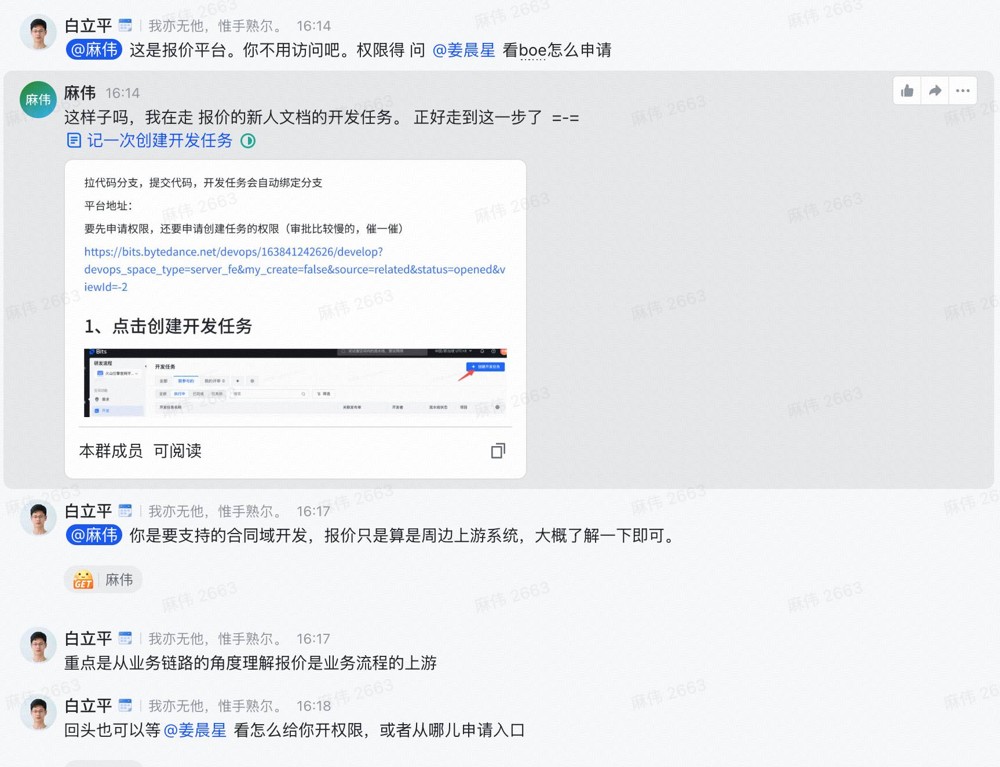

# 写在前头

我昨天入职了，昨天忙了一天今天理论上来说应该是安稳学习，走完新人学习文档的一天 

按照我上家公司的流程 今天应该是简单开发一些内容跑通一个主流程

# 我的规划

1. 就像走一下新人文档
2. 更改代码中的一行日志 走一次开发-自测-PR 主流程

## 问题

1. 我看新人文档的时候遇到了一大堆问题 

各种历史旧文档没内容，没权限，各种名词各种逻辑乱跳

2. 然后我就去走开发主流程

我确实是 创建了一个branch 然后提交了，但是线上的 CI 环境一直没有通过 不是他妈的 command fail 就是他妈的  no permission 或者是一些更离谱的错误

他妈我之前那家公司怎么要这么离谱，我草你妈的，他妈开发就开发，而且这个不应该找运维吗，他妈这个运维又是谁

然后我把重心转到体验业务上，我打算打开我们业务的网站但是我发现我打不开，提示没有权限，也不跟我说要去和谁申请权限

我他妈又去问了我的leader，我leader回复他妈什么意思

什么叫做 我不需要访问这个业务网页，那他妈发给我的这个文档就是他妈的这个业务的文档啊

这他吗什么意思 我草泥马的 ，就是干看文档 干看代码，不让体验业务 ？？？ 

```txt
@麻伟 这是报价平台。你不用访问吧。权限得 问 @姜晨星 看boe怎么申请
@麻伟 你是要支持的合同域开发，报价只是算是周边上游系统，大概了解一下即可。
重点是从业务链路的角度理解报价是业务流程的上游
```



# 情绪

## 生气

你他妈招我进来，他妈有不管我是他妈什么意思

## 不舍

他妈的，昨天才到了10多个快递

我刚买的鸡胸肉 刚买的玉米 刚买的护肤品 刚卖的垃圾袋 刚买的茶叶 刚买的洗发水 沐浴露 .... 

我他妈刚交的 3个月房租 我草泥马

