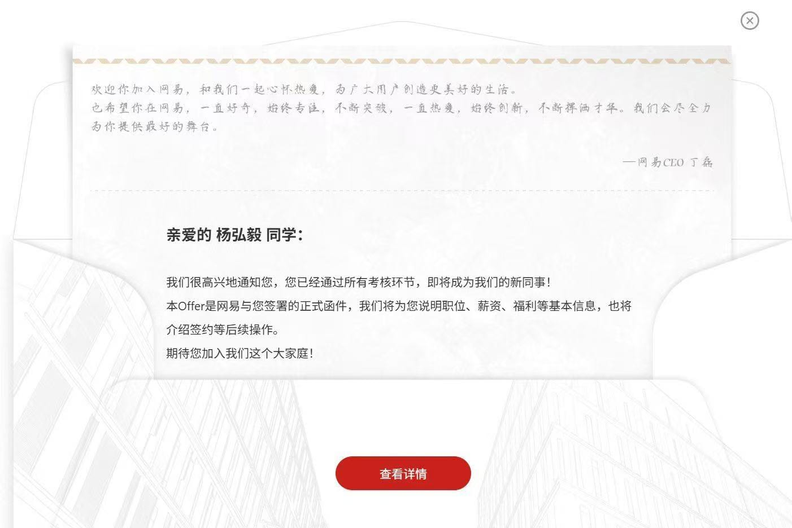

# 写在前头

明天就要入职了，睡个中午觉起来，发现比我小一届的学弟竟然跳槽到网易了有点惘然

我的朋友可以说没有，所以只能把他们称作伙伴 

当我毕业了，换了工作，离开某个城市。我所谓的朋友就自然的断连了，所以可以认为我没有什么朋友

我的朋友们看着都过的很好，我有点嫉妒有点茫然

## Numpy

Numpy 我想想 毕业于 重庆理工大学，双非 机械专业

自学了 C++，PAT甲级满分，蓝桥杯B组国二 

一开始入职的是恒生，薪资 15k 还是 11k base 杭州。后面恒生 开始加班 然后他开始跑路

边工作边面试。他不喜欢海投，后面跳槽到了百度的搜推 薪资 22k

他跟我说工作内容，沟通下来比较像是运维，某周需要加班 on call . 不过活大部分都是配置相关的内容

恒生工作2年，跳槽到百度，百度工作了快2年

然后百度裁员，和我差不多一个月被裁了。现在社招一个半月 

裁员的时候 就被其他 hr 加上了 推了 拼多多，字节，oppo子公司 这几家看着都挂了，oppo子公司走完hr面后没后续

现在在走腾讯的 Wxg 预计 offer，总共面了5轮了，2面技术面，2面面委面，1面hr面。 等待 offer 中

## YangHongYi

YangHongYi 我的学弟跟我一个学校 ，实习的时候 我辅导过他一阵子，他的实习简历我记得和我的差不多

或者说他比我多了一个 mit6.824 。我们学校支持外出实习一年，这应该是一个很不错的红利

他在上海游卡实习，然后转正，毕业薪资 17k 

我工作了两年，那么他应该是工作了1年2个月 。 现在跳槽去了网易

我不知道这一年他发生了什么，他之前在游戏公司工作，所以经验match到了网易？ 

他获取到 算法比赛奖项和差不多的，但是我是软件工程 他是电子信息工程 专业不同。其他都差不多

我们都没有选择研究生 而是直接工作，貌似他现在混的比我好

## Guenhao 

Guenhao 我学弟的学弟 。 现在在美团实习 

他研毕了一年，因为挂科了导致没保研上，现在应该是正好在研毕。干的 Agent 实习，他的论坛我完全看不懂了，看着涉及到一些 AI 的论文

我们同一个专业 学的同一个专业课，但是现在工作的内容完全看不懂

## 其他人

其他人，大部分都保研去了，我认为他们读了研出来肯定有更好的生活的 不像我

## 我

我始终不知道我走错了哪一步

有一句话是这么说的  "选择比努力更重要"，

如果说我高考失利并没有错误，那么跟我同校或者是学校弱于我，甚至专业弱于我的人，他们貌似都过的比我好

那么你说我实习的时候错了吗？ 没有找到好的公司，去了一家 加密货币的小公司 ？

可是我这个公司也有很多 985 ，211 啊都是硕士 。不过从竞争力上来说，我选择了这家公司确实没有什么竞争力，B圈 web3 在国内就很少有工作

那么我实习选择错了，为什么我选择错了，因为我不努力，所以我在找实习的时候没有好选择，所以我没办法选，我只能这么选吗，我看是的

但是为什么简历，同样的学校，不同专业，过了一年 我学弟就可以去中小公司 我就不行 。是我不够努力？我太笨了，我表达不清楚？我背东西不够熟练？还是说时运不济 ？

我工作了2月2个月，找工作了2个月，面试12家，最终失败，选择了外包，虽然涨薪了40%，但是我高兴不起来

这时候，我貌似更想看中title，而不是工资

他们貌似有更美好的未来，但是我貌似已经没有了

我应该怎么办呢 报个班吗，报班就能好起来吗

简历包装一下吗

### 补充

嫉妒，无比的嫉妒 。 Numpy 现在通知 Wxg OC了。 明明大家都是在用 Ai 编程

无非是履历不同，明明大家都差不多，为什么他们可以这么成功 ？为什么我不行

我感觉我从小到大都是失败的，我脑子里面又有一种声音了 “为什么事情又变成这样了”，为什么又变成这样了！！为什么，为什么，为什么，为什么，为什么

就因为我父母不是小学都没毕业？就因为我是农村人？就因为我没有接受过良好的教育？小时候没有被好好爱过？

为什么他妈会这样子！我操你妈，为什么

YangHongYi 是福建人，家里有国外的亲戚，Guenhao 是山东人家里开理发店的， Numpy 在重庆省会有个房子 ，其他保研的家里也不错

为什么 我不行，为什么，为什么事情又变成这样子了，我到底做错了哪一步？从一出生就错了？我日你妈，草你妈的生活

为什么我他妈甚至记不得我上个月准备的面试，为什么我他妈面试不通过，为什么大厂没有HC，为什么我简历不通过

为什么我都这么努力的工作了，裁员还要把我裁掉，为什么明明我才和女朋友确认关系，我就要分别，为什么，为什么

