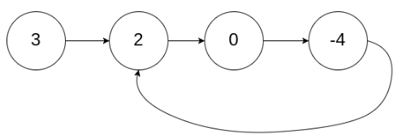

#  142.环形链表II

力扣链接： https://leetcode.cn/problems/linked-list-cycle-ii/

题目： 给你一个链表，其尾部可能成环，让你返回入环的第一个节点 . 



## 思路

题目要求 :

==1. 判断是否有环== 

==2. 判断环的入口== 


### 判断是否有环

1. 使用快慢指针，快指针比慢指针多走一步 。 如果有环的话 ，那么这多走的 1 步 会在==多次重复的时候相遇==


### 判断环的入口


```go
head ----a----> 入口 E ----b----> 相遇点 M ----c----> 入口 E
                 └──────── 环长 C = b + c ────────┘
```

- $a$：头到环入口的距离
- $b$：入口沿环走到相遇点
- $c$：相遇点再走回入口
- $C = b + c$：环长

#### 推导步骤

1. **快慢指针相遇**  
   慢每次走 1，快每次走 2。相遇时：
   - 慢走过：$a + b$
   - 快走过：$a + b + mC$（多绕了 $m$ 整圈，$m \ge 1$）  
   注意：$mC = m(b+c)$，多走的是整圈，不是只多走 $c$。

2. **用「快 = 2 × 慢」列方程**

$$
a + b + mC = 2(a + b)
$$

$$
a + b = mC
$$

$$
a = mC - b = (m-1)C + c
$$

（因为 $C - b = c$，所以 $mC - b = (m-1)C + c$）

3. **同余含义**  
   $a = (m-1)C + c$ 就是 $a \equiv c \pmod{C}$：  
   $a$ 和 $c$ 相差整数个环长。  
   在环上走时，走 $a$ 步 和 走 $c$ 步 **终点相同**（多走的整圈等于原地转圈）。

4. **找入口的做法**  
   相遇后：
   - 一个指针放回 `head`
   - 另一个留在相遇点 $M$
   - 两个都每次走 1 步  

   从头走 $a$ 步 → 到入口。  
   从 $M$ 走 $a$ 步 = 走 $c + (m-1)C$ 步 → 先空转 $(m-1)$ 圈，再走 $c$ → 也到入口。  

   ==再次相遇的点就是环入口。==

#### 小例子

```
1 → 2 → 3 → 4
         ↑   ↓
         6 ← 5
```

入口是 3，环长 $C=4$。若在 5 相遇：$a=2,\ b=2,\ c=2$。  
检查：$a+b=4=1\cdot C$，且 $a=c=2$。  
从头：1→2→**3**；从 5：5→6→**3**。两步后都到入口。
