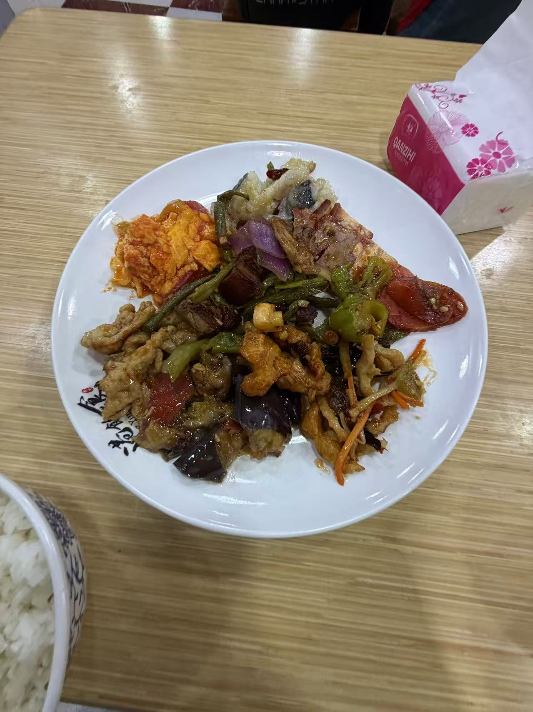
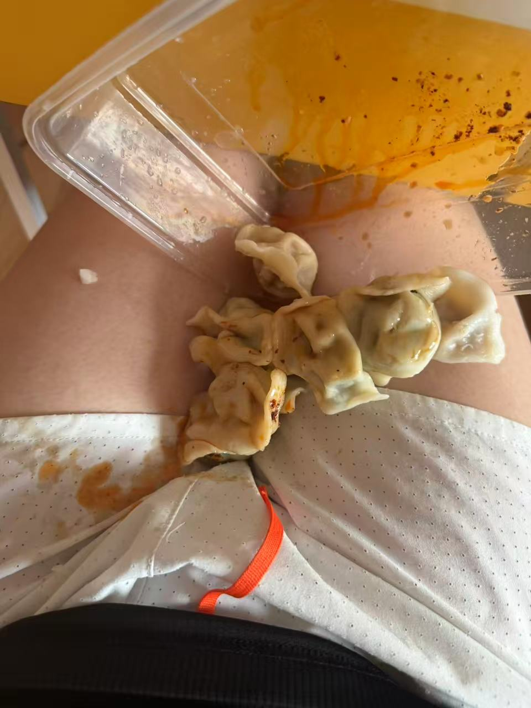

这是我来到北京的第三天 

早上我记得很早我就起来了，大概是 8:30 左右就起来了

我起来之后干嘛了呢？ 我忘记了 我只记得我跟我女朋友说 我今天要复盘总结一下最近发生的事 和 当下的状态

但是一早上好像都没复盘好，写的文章也只有一半还是没有定整个方向，感觉整个人生还是没有规划好 [文章](https://marvel-l.github.io/Blog/post/%E5%8C%97%E4%BA%AC%E5%B7%A5%E4%BD%9C%E5%88%87%E6%8D%A2-0x01)

中午 11:00 左右洗了个头然后出去吃饭，今天是打算去吃自选菜 吃点米饭

中午吃了很多东西，什么番茄炒蛋啊, 鱼香肉丝，洋葱炒肉，茄子烧肉什么的，北京的菜都比较偏甜 让人喜欢不起来

中午和下午记不清怎么过的了，可能依旧是在写那个文章，然后回到家里睡觉刷抖音什么的

大概下午 16:00 左右点了一个拼好饭 15块钱 30个饺子，饺子不好吃，皮很硬

但是量很大价格也便宜

吃的时候不小心弄到我的白色短裤上了，又洗了一个澡 洗了一条裤子，好歹洗掉了

为什么我下午要吃这一顿呢，我感觉是太迷茫了，不想再北京待，但是又不得不再北京待，并不认为我有一个美好的未来

所以就压力大，我压力大的时候要么 看片，运动，吃饭然后催吐 。大概这几个

所以就吃饭然后催吐

因为我租的房子是合租，厕所门关的 我不确定有没有人，等了 30 分钟还是没出来 

然后我敲门发现里面根本没人

晚上的时候 18:00 的时候，我去跑步了，在旁边的一个公园

北京这里没有什么可以跑步的地方，全都是胡同小道

想要跑步要么去健身房要么去公园

公园晚上很黑，我感觉我上班了之后就不能去公园跑了，一圈大概是700米

我跑了3公里 （5分钟，5:40，8分） 这几个配速，好久没跑步了 跑步越来越不行了，不过跑完步还是比较爽的

跑完步后差不多19:00，然后去吃中午那家店，中午那家店在 19:00-20:30是自助餐模式，我打算用来补补蛋白

我吃饭的时候发现那个点人很少，可以说只有我一个人，而且很多蛋白质要么高糖要么高盐。可能早上的时候我太饿了所以没吃出来

目前还是没找到一个可以很好补充蛋白的地方，大部分都是碳水 和高糖高盐

跑步完之后洗澡的感觉很爽太爽了

今天和女朋友还是聊的很好，我们没有发生矛盾